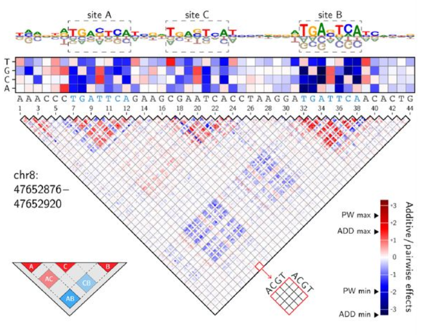

# Integrated_Hessians: An IntegratedHessians Implementation for Feature Interaction Attribution with Pytorch Models  

## Caution: This repository is work in progress (WIP).

## Background

Integrated Gradients is an interpretability method in deep learning, focused on explaining feature interactions via attributions. It is developed by [Janizek et al. (2021)](#references).

## Motivation for this implementation

- The authors have not provided a formal API in [path_explain](https://github.com/suinleelab/path_explain)
- For high number of features, the naive implementation becomes memory and compute constrained, the API needs an option to subset/choose which featues should be incorporated into the analysis, reducing the computational load. This is especially useful for one-hot encoded features like those seen in genomic sequences.
- More plotting options, preferably those that incorporate the subsetting option would be desirable. For example, a hybrid plot with subsetted feature attributions on top, calculated with integrated gradients, and 45 degree rotated interaction half-matrix at the bottom, like those found in [squid-manuscript](https://github.com/evanseitz/squid-manuscript/blob/e3cbd567448a0db8cef0877702594d7d8c20484b/squid/figs_surrogate.py#L290)
- [Janizek et al. (2021)](#references) tests this method with a language modelling example and a small XOR network. I believe there could be an interesting test case where a model learns interactions between genomic motifs, and then the user unravels the learned behaviour by looking at interactions attributions.
<figure>
  
  <figcaption>An example interaction attribution plot from <a href="#references">Seitz et al. (2021)</a></figcaption>
</figure>

## API
**WIP**

## Performance comparison
**WIP**

## Test Case: Motif Interactions
**WIP**

1. Acquire 12 exemplary motif positional frequency matrices(pfm) from JASPAR(Baydar Ovek et al.).
2. Generate 100 000 DNA sequences of length 100.
3. Seperate motifs into 4 uniform groups.
    -   Group A: Purely additive. Existence of a single motif from this group increases the arbitrary phenotype value by 0.5.
    -   Group B: Hybrid. Existence of a single motif from this group increses the arbitrary phenotype value by 0.25, if another motif of this group exists in the same sequence, it is instead increased by 0.5. Which means that if two motifs from group B is present in a sequence, the value is 1.
    -   Group C: Purely interactive. Arbitrary phenotype is 1 if two motifs from this group exists in the sequence, otherwise phenotype is 0.
    -   Group D: Neutral, these motifs do not affect the phenotype.
4. For each sequence, randomly sample two motifs, add them to the sequence, and set the arbitrary phenotype value for the sequence a value between 0 and 1 according to the rules mentioned above.
6. Convert sequences to one-hot encoding.
5. Train a Transformer model with CNN embedding on these sequences.
6. Utilize Integrated Hessians package to produce interaction attributions and plot the results.

## References

Janizek , J. D., Sturmfels, P., & Lee, S. I. (2021). Explaining Explanations: Axiomatic Feature Interactions for Deep Networks. *Journal of Machine Learning Research*, 22(104), 1-54. http://jmlr.org/papers/v22/20-1223.html

Seitz, E.E., McCandlish, D.M., Kinney, J.B., and Koo P.K. Interpreting cis-regulatory mechanisms from genomic deep neural networks using surrogate models. Nat Mach Intell (2024). https://doi.org/10.1038/s42256-024-00851-5

Baydar Ovek D, Rauluseviciute I, Aronsen DR, Blanc-Mathieu R, Bonthuis I, de Beukelaer H, Ferenc K, Jegou A, Kumar V, Lemma RB, Lucas J, Pochon M, Yun CM, Ramalingam V, Deshpande SS, Patel A, Marinov GK, Wang AT, Aguirre A, Castro-Mondragon JA, Baranasic D, Chèneby J, Gundersen S, Johansen M, Khan A, Kuijjer ML, Hovig E, Lenhard B, Sandelin A, Vandepoele K, Wasserman WW, Parcy F, Kundaje A, Mathelier A JASPAR 2026: expansion of transcription factor binding profiles and integration of deep learning models Nucleic Acids Res. 2026 Jan 6;54(D1):D184-D193.; doi: 10.1093/nar/gkaf1209